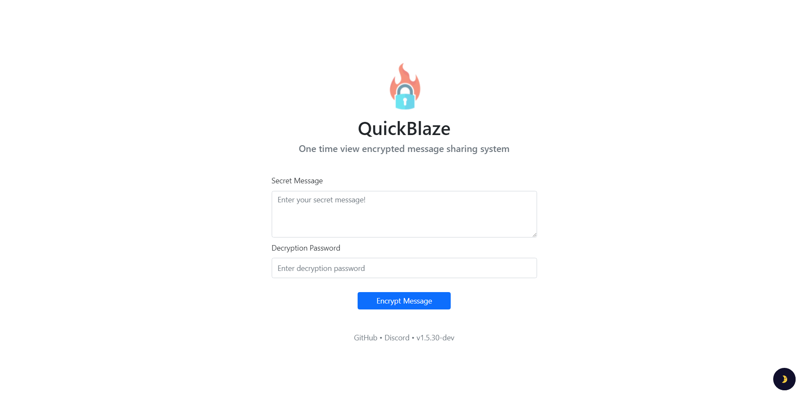
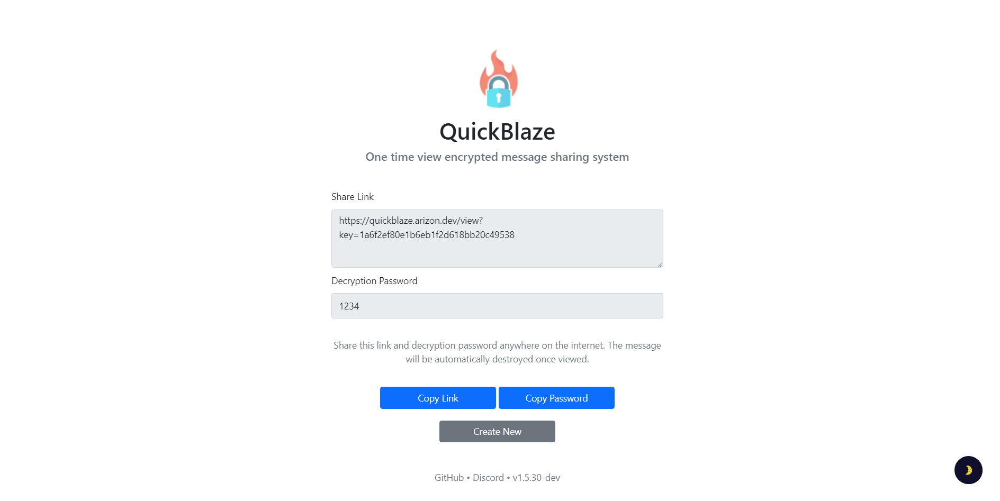
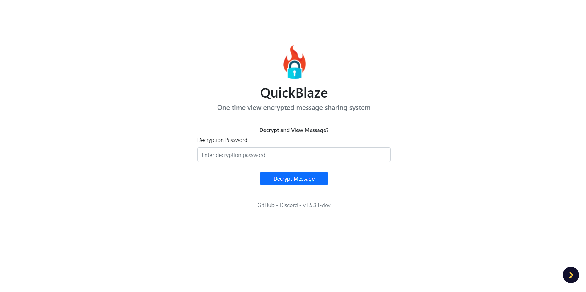
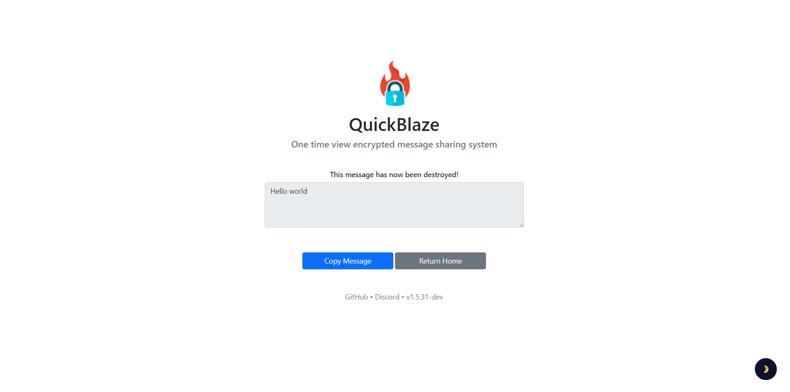

<div align="center">
  </img>
</div>
<h1 align="center">
  Quickblaze Encrypt
</h1>

<p align="center">
  
  <a href="https://github.com/arizon-dev/quickblaze-encrypt/blob/main/LICENSE" target="_blank">
    
  </a>
  <a href="https://www.codacy.com/gh/arizon-dev/quickblaze-encrypt/dashboard?utm_source=github.com&amp;utm_medium=referral&amp;utm_content=arizon-dev/quickblaze-encrypt&amp;utm_campaign=Badge_Grade"></a>
  <a href="https://github.com/arizon-dev/quickblaze-encrypt/actions/workflows/codacy.yml"></a>
  <a href="https://arizon.dev?discord" target="_blank">
    
  </a>
</p>

> An extremely simplistic, one-time view encryption system. Send links anywhere on the internet, and your encrypted message will automatically be destroyed after being viewed!

### ✨ [Click to view Demo](https://quickblaze.arizon.dev)

## Requirements

- PHP v8.1.10.
- Accessible webserver with PHP support.
- MySQL server for database host. *(Optional)\**
- PHP [MYSQL](http://php.net/manual/en/book.mysql.php) module for database access. *(Optional)\**
- PHP [PDO](http://php.net/manual/en/book.pdo.php) module for database access. *(Optional)\**
- PHP [OPENSSL](http://php.net/manual/en/book.openssl.php) module for encryption.
- PHP [MBSTRING](http://php.net/manual/en/book.mbstring.php) module for full UTF-8 support.
- PHP [JSON](http://php.net/manual/en/book.json.php) module for JSON manipulation.

***Optional:** dependant on storage method configuration in `.config`. [See below.](#system-configuration)*

## Installation

1. Download the latest version of Quickblaze from the [releases page](https://github.com/arizon-dev/quickblaze-encrypt/releases).
2. Upload and extract the contents to your web server. You can also pull the repo with GitHub Desktop.
3. Visit your domain installation directory or subdomain <https://example.com/quickblaze-encrypt/>

**Don't** delete the `.version`, `.config`, or cache files once the installation has completed! They contain necessary version and configuration data, and removing them will cause issues!

If using MySQL as storage method:

- Update the database connection information in `modules/Database_example.env`.
- Rename the database configuration file to `Database.env`.
- View example database configuration below.

## System Configuration

Example configuration of `Database.env`.

```js
{
    "HOSTNAME": "mysql.example.com", // Database Host
    "USERNAME": "admin", // Database Username
    "PASSWORD": "admin123", // Database Password
    "DATABASE": "quickblaze_db" // Database Name
}
```

 default configuration of `.config`.

```js
{ 
  "STORAGE_METHOD": "mysql", // options: 'mysql', 'filetree'
  "LANGUAGE": "auto", // options: 'auto', 'en', 'ru', 'is', etc.
  "INSTALLATION_PATH": "https://example.com" // No trailing slash
}
```

## What is Quickblaze?

This tool provides users with the ability to create private messages that are both secure and shareable, thanks to an encryption method that guarantees the message can only be decrypted once. In addition, the tool allows users to input a decryption password that they can share with the recipient to access the message. The message is then stored either locally or in the configured MySQL database allowing for customisation in how the messages are stored.

In the event that you misplace your password or decryption key*, it will be impossible to access the encrypted message. Your decryption key serves to verify your password and to decrypt the message contents. It's important to keep in mind that the Arizon team will not provide any assistance in retrieving passwords for messages that were created on the Quickblaze website.

> Upon creating a message, an encryption key is generated, and it can be viewed in the URL of your message. For example, in `example.com/view?key=fb304cb9b3d8d38d82`, the decryption key would be `fb304cb9b3d8d38d82`.

## Screenshots
### [💡 Click here for a live demo!](https://quickblaze.arizon.dev)

<div align="center">
  
  
  
  
</div>
  
## Public API

The Quickblaze API is a tool which offers a straightforward and user-friendly REST API, which enables you to seamlessly integrate Quickblaze into your projects and applications.

Public API Base URL:

```
https://quickblaze.arizon.dev/api/interactions/{endpoint}
```

Available Endpoints:

<details>
 <summary><code>GET</code> <code><b>/{createEncryption}</b></code></summary>

##### Parameters

> | name |  type     | data type      | description        |
> |------|-----------|----------------|--------------------|
> | `data` | required | string | The plain string message to be encrypted. |
> | `password` | required | string | The password to use to allow users to decrypt the message. |

##### Responses

> |  object  | value |
> |---------------|----------|
> | `response_code`|200 |
> | `data`| `message, encryption_key, password` |
> | `request_header`| `timestamp, ip, user_agent`|

##### Example cURL

> ```bash
> curl -X GET -H "Content-Type: application/json" http://quickblaze.arizon.dev/api/interactions/createEncryption?data=HelloWorld&password=1234
> ```
</details>
<details>
 <summary><code>GET</code> <code><b>/{decryptMessage}</b></code></summary>

##### Parameters

> | name |  type     | data type      | description        |
> |------|-----------|----------------|--------------------|
> | `key` | required | string | The encryption key used to specify the message. |
> | `password` | required | string | The valid password to use to decrypt the message. |

##### Responses

> |  object  | value |
> |---------------|----------|
> | `response_code`|200 |
> | `data`| `message, decrypted_contents, key, password` |
> | `request_header`| `timestamp,` `ip,` `user_agent`|

##### Example cURL

> ```bash
> curl -X GET -H "Content-Type: application/json" http://quickblaze.arizon.dev/api/interactions/decryptMessage?key=4b6d76205bc1dda9ee7&password=1234
> ```

</details>
<details>
 <summary><code>GET</code> <code><b>/{checkEncryption}</b></code></summary>

##### Parameters

> | name |  type     | data type      | description        |
> |------|-----------|----------------|--------------------|
> | `key` | required | string | The encryption key used to check if the message exists. |

##### Responses

> |  object  | value |
> |---------------|----------|
> | `response_code`|200 |
> | `data`| `message,` `message_exists,` `key` |
> | `request_header`| `timestamp,` `ip,` `user_agent`|

##### Example cURL

> ```bash
> curl -X GET -H "Content-Type: application/json" http://quickblaze.arizon.dev/api/interactions/checkEncryption?key=4b6d76205bc1dda9ee7
> ```

</details>
<details>
 <summary><code>GET</code> <code><b>/{getCreationDate}</b></code></summary>

##### Parameters

> | name |  type     | data type      | description        |
> |------|-----------|----------------|--------------------|
> | `key` | required | string | The encryption key used to fetch the message creation date. |

##### Responses

> |  object  | value |
> |---------------|----------|
> | `response_code`|200 |
> | `data`| `message,` `date_created,` `key` |
> | `request_header`| `timestamp,` `ip,` `user_agent`|

##### Example cURL

> ```bash
> curl -X GET -H "Content-Type: application/json" http://quickblaze.arizon.dev/api/interactions/getCreationDate?key=4b6d76205bc1dda9ee7
> ```

</details>

## Author & Maintainer
### 🙍 axtonprice
[](https://github.com/axtonprice)
[](https://twitter.com/axtonprice)
[](https://github.com/sponsors/axtonprice)

## Contributors
[](https://github.com/RChutchev)
[](https://github.com/brendanprice2003)
[](https://github.com/masondq)

## ❤️ Show your support

If you like this project, give a star to support us! ⭐️<br>
Want to sponsor us? [Become an Arizon sponsor here!](https://github.com/sponsorships/arizon-dev)

## 📝 License

Copyright © 2023 [axtonprice](https://github.com/axtonprice) & [Arizon Software](https://github.com/arizon-dev).<br />
This project is [GNU GPL v3.0](https://github.com/arizon-dev/quickblaze-encrypt/LICENSE.txt) licensed.

## 🎮 Discord
<a href="https://discord.gg/dP3MuBATGc"></a>
<!-- end: README.md -->